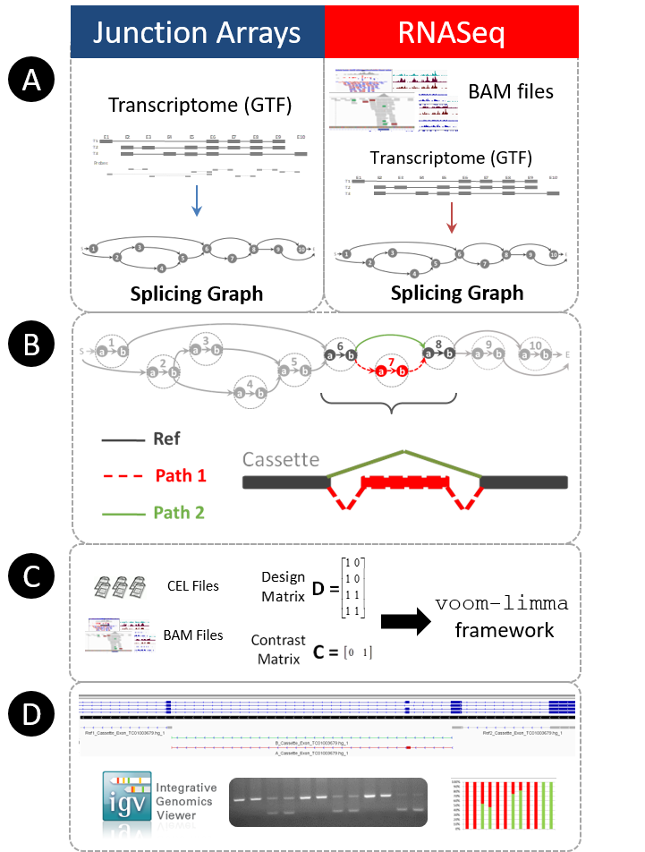
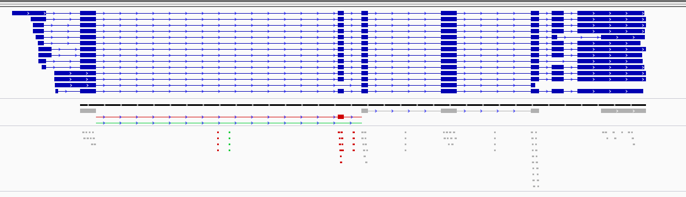
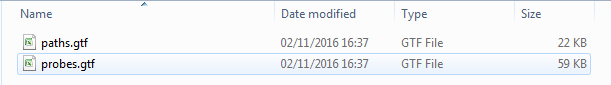
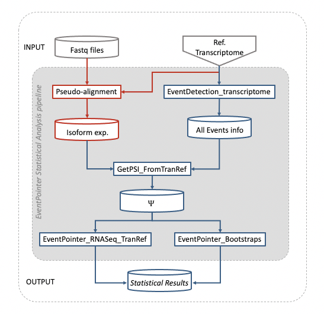
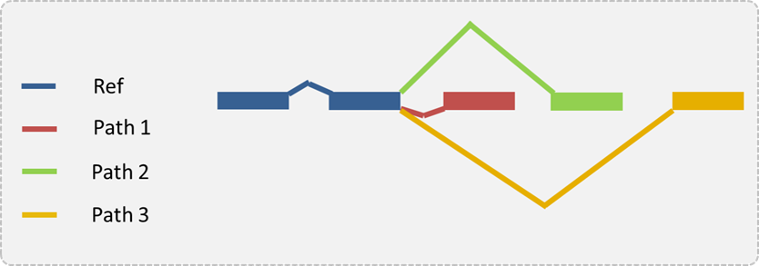
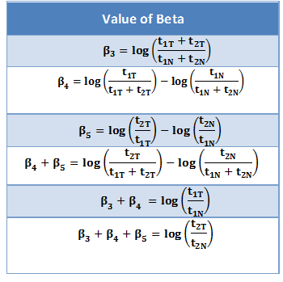

```{r LoadFunctions, echo=FALSE, message=FALSE, warning=FALSE, results='hide'}
library(knitr)
opts_chunk$set(error = FALSE)
library(EventPointer)
library(dplyr)
library(kableExtra)
```

```{r style, echo = FALSE, results = 'asis'}
##BiocStyle::markdown()
```

# Installation
EventPointer can be installed from Bioconductor using the BiocManager package:

```{r, eval=FALSE}

library(BiocManager)

if (!requireNamespace("BiocManager", quietly=TRUE))
    install.packages("BiocManager")

BiocManager::install("EventPointer")
```

# Introduction

*EventPointer* R package provides users a simplified way to identify, classify and visualize alternative splicing events. The steps required by the algorithm are almost identical for both technologies. The algorithm only differs in its inital step. 

* *Splicing Graph Creation* The Splicing Graph (SG) is a directed graph used to represent the structure of a gene. EventPointer relies on SGSeq package to obtain the corresponding SGs  for every gene present in the experiment. For arrays, the SG is built according to the reference transcriptome selected by the user and for RNA-Seq, it is created by predicting the features in the .bam files provided by the user.

* *Event Identification* Once the graphs are created, EventPointer analyzes each SG in order to find the alternative splicing events. The definition of splicing events by EventPointer consists in a triplet of subgraphs (P1,P2 and PR) i.e. for a cassette exon, PR correspond to the flanking exons, P1 the junctions and exon, and P2 the junction that skips the exon. This is depicted in Figure 1.


* *Statistical Analysis*  With all the detected events, EventPointer performs a statistical analysis to obtain the statistical significance of every splicing event. Briefly, EventPointer considers there is a differential splicing event if the isoforms in the associated paths change their expression in opposite directions. Different statistical tests can be applied (see Advanced Use).

* *Visualization* To ease the interpretation of the splicing events, EventPointer generates .gtf files that can be loaded into Integrative Genomcis Viewer (IGV). The visualization allows researchers to design primers to validated the detected events using standard PCR.

Figure 2 shows each of the main steps in a graphical layout.

This vignette is divided in two sections. In the first one, the complete analysis for junction arrays is described and the second one describes the analysis for RNA-Seq data.

To cite *EventPointer*:

* Romero, Juan P., et al. "EventPointer: an effective identification of alternative splicing events using junction arrays." BMC genomics 17.1 (2016): 467. [doi:10.1186/s12864-016-2816-x](http://bmcgenomics.biomedcentral.com/articles/10.1186/s12864-016-2816-x)

* Romero, Juan P., et al. "Comparison of RNA-seq and microarray platforms for splice event detection using a cross-platform algorithm." BMC genomics 19.1 (2018): 703. [doi:10.1186/s12864-018-5082-2](https://bmcgenomics.biomedcentral.com/articles/10.1186/s12864-018-5082-2)



# Analysis of junction arrays
## Overview of junction arrays
*EventPointer* is prepared to work with different Affymetrix arrays, such as: HTA 2.0, Clariom-D, RTA and MTA.

To build the CDF file (to work under the aroma.affymetrix framework), EventPointer requires a GTF file with the reference transcriptome information. In case not provided, the algorithm automatically downloads the required information from different databases such as ENSEMBL or UCSC. As the probes for the HTA 2.0 array are mapped to the HG19 genome, the latests versions of the ensembl and ucsc genome, mapped to the hg19 version, will be downloaded. For the other arrays, the following genomes are used: ClariomD = GRCh38, MTA = mm10 and RTA = rn6.

The required files are: 

1. Exon probes genomic position (Tab separated .txt file)
2. Junction probes genomic position (Tab separated .txt file)
3. Reference transcriptome (GTF file)

Files 1 and 2 contain probe information for the array. These files and the corresponding
CDF files can be downloaded from the following URL: [EventPointer Dropbox](https://www.dropbox.com/sh/wpwz1jx0l112icw/AAAOU0M2QS0TjqHAhrrdEhp6a?dl=0)

The format of these files is briefly explained in the following paragraphs:

For the Exon Probes, the file corresponds to a tab separated .txt file composed of 11 columns that include: Probe Id, X coordinate in the array, Y coordinate in the array, Transcript Cluster Id, Probeset Id, Probeset name, Probe sequence, chromosome, start, end and strand.

The Junction probes file is also a tab separated .txt composed of 10 columns: Probe Id, X coordinate in the array, Y coordinate in the array, Transcript Cluster Id, Probeset Id, Probeset name, Probe sequence, chromosome and probe alignments.

For the GTF the standard format is used. (For more information see [GTF](http://mblab.wustl.edu/GTF22.html))

This vignette uses the probes and annotation file for the DONSON gene in order to
run the examples in a short amount of time. To generate the corresponding  CDF file
for the whole genome, the files from the Dropbox link must be used.

<span style="color:red">**Note:**</span> It is advisable to work with reference GTF files, as the probes are annotated to them. However, if other database is used, the algorithm will only include probes that are mapped to such database.

## CDF file creation

This step can be skipped if the corresponding CDF file is doownloaded from the Dropbox
link. The available CDF files were generated using the GTF files for each of the arrays,
if users want to generate a CDF for other databases (Ensembl or UCSC), this step should
be used.

The function **CDFfromGTF** generates the CDF file used afterwards in the aroma.affymetrix pre-processing pipeline. Internally, it calls flat2cdf function written by Elizabeth Purdom. More information about it can be seen in the following webpage: [Create CDF from scratch](http://www.aroma-project.org/howtos/create_CDF_from_scratch/) 


The required input for the function is described below:

- **input** : Reference transcriptome. Available options are : "Ensembl","UCSC" , "AffyGTF" and "CustomGTF".
- **inputFile**: If input is "AffyGTF" or "CustomGTF", inputFile should point to the GTF file to be used.
- **PSR**: Path to the Exon probes txt file
- **Junc**: Path to the Junction probes txt file
- **PathCDF**: Directory where the output will be saved
- **microarray**: Microarray used to create the CDF file. Must be one of: "HTA-2_0", "ClariomD", "RTA" or "MTA".

This function takes a couple of hours to complete (depending on the computer), and creates the following files:

1. EventsFound.txt : Tab separated file with all the information of all the alternative splcing events found.
2. .flat file : Used to build the corresponding CDF file.
3. .CDF file: Output required for the aroma.affymetrix preprocessing pipeline.

The following code chunks show examples on how to run the function using part of the Affymetrix GTF and the example data included in the package. This data corresponds to the Affymetrix HTA 2.0 GTF representing only the DONSON gene and the probes that are mapped to it.

  Using Affymetrix GTF as reference transcriptome
```{r CDFGTF, eval=TRUE, warning=FALSE, collapse=TRUE}

# Set input variables
   PathFiles<-system.file("extdata",package="EventPointer")
   DONSON_GTF<-paste(PathFiles,"/DONSON.gtf",sep="")
   PSRProbes<-paste(PathFiles,"/PSR_Probes.txt",sep="")
   JunctionProbes<-paste(PathFiles,"/Junction_Probes.txt",sep="")
   Directory<-tempdir()
   array<-"HTA-2_0"
   
# Run the function

   CDFfromGTF(input="AffyGTF",inputFile=DONSON_GTF,
              PSR=PSRProbes,Junc=JunctionProbes,
              PathCDF=Directory,microarray=array)

```

<span style="color:red">**Note:**</span> Both the .flat and .CDF file take large amounts of space in the hard drive, it is recommended that the directory
has at least 1.5 GB of free space.


Figure 3 shows a screen shot with the output of the CDFfromGTF function


Once the file is created, the name of the cdf file can be changed. Internally, the algorithm gives the name as HTA-2_0, but the actual name of the file can be different. In the rest of the vignette, we have renamed our CDF file as EP_HTA-2_0.

Once the CDF file has been created, it can be used for the analysis of different experiments.

## Statistical Analysis

### aroma.affymetrix pre-processing pipeline

For microarray data, a pre-processing pipeline must be applied to the .cel files of the experiment. Usually this pre-processing is done using the aroma.affymetrix R package. This procedure normalizes and summarizes the expression of the different probesets into single values.

The aroma.affymetrix R package provides users different functions to work with affymetrix arrays. The functions are used to extract all the information contained in the .cel files and to do all the required pre-processing steps such as background correction, normalization and summarization. The package requires a certain folder structure in order to work correctly. For more information about aroma.affymetrix visit the webpage:[aroma project](http://www.aroma-project.org/) 

The following code chunk displays the pipeline used to get the results required by EventPointer after the pre-processing using aroma.affymetrix. The code is not intended to be a runable example, but just to show users the settings and functions that can be used. In order for users to have a runable example, the corrrespoding folder structure and files are required.

```{r aroma, eval=FALSE}

# Simple example of Aroma.Affymetrix Preprocessing Pipeline

verbose <- Arguments$getVerbose(-8);
timestampOn(verbose);
projectName <- "Experiment"
cdfGFile <- "EP_HTA-2_0,r"
cdfG <- AffymetrixCdfFile$byChipType(cdfGFile)
cs <- AffymetrixCelSet$byName(projectName, cdf=cdfG)
bc <- NormExpBackgroundCorrection(cs, method="mle", tag=c("*","r11"));
csBC <- process(bc,verbose=verbose,ram=20);
qn <- QuantileNormalization(csBC, typesToUpdate="pm");
csN <- process(qn,verbose=verbose,ram=20);
plmEx <- ExonRmaPlm(csN, mergeGroups=FALSE)
fit(plmEx, verbose=verbose)
cesEx <- getChipEffectSet(plmEx)
ExFit <- extractDataFrame(cesEx, addNames = TRUE)
```

### EventPointer function
EventPointer is the main function of the algorithm

The function requires the following parameters:

- **Design** : The design matrix for the experiment.
- **Contrast**: The contrast matrix for the experiment.
- **ExFit**: [aroma.affymetrix] pre-processed variable after using extractDataFrame(affy, addNames=TRUE)
- **Eventstxt**: Path to the EventsFound.txt file generated by CDFfromGTF function.
- **Filter**: Boolean variable to indicate if an expression filter is applied.
- **Qn**: Quantile used to filter the events (Bounded between 0-1, Q1 would be 0.25).
- **Statistic**: Statistical test to identify differential splicing events, must be one of : "LogFC","Dif_LogFC" and "DRS".
- **PSI**: Boolean variable to indicate if $\Delta \Psi$ should be calculated for every splicing event.

If the `Filter` variable is `TRUE`, the following is performed:

The summarized expression value of all the reference paths is obtained and the
threshold is set depending on the `Qn` value used.

An event is considered if at least one sample in all paths is expressed
above the threshold.

The rest of the events are not shown unless the `Filter` variable is set to `FALSE`

```{r EP_arrays, eval=TRUE}

   data(ArraysData)

   Dmatrix<-matrix(c(1,1,1,1,0,0,1,1),nrow=4,ncol=2,byrow=FALSE)
   Cmatrix<-t(t(c(0,1)))
   EventsFound<-paste(system.file("extdata",package="EventPointer"),"/EventsFound.txt",sep="")
   
   Events<-EventPointer(Design=Dmatrix,
                      Contrast=Cmatrix,
                      ExFit=ArraysData,
                      Eventstxt=EventsFound,
                      Filter=FALSE,
                      Qn=0.25,
                      Statistic="LogFC",
                      PSI=TRUE)
```

Table 1 displays the output of EventPointer function 

```{r EP_Arrays_Res_Table, echo=FALSE}
kable(Events[1:5,],digits=5,row.names=TRUE,align="c",caption = "Table 1: EventPointer Arrays results")
```

The columns of the `data.frame` are:

- **Gene name **: Gene identifier
- **Event Type**: Type of alternative splicing event (Cassette, Alternative 3',Alternative 5', Alternative Last Exon, Alternative First Exon,
              Mutually Exclusive Exons or Complex Event)
- **Genomic Position**: Genomic Coordinates for the event
- **Splicing Z Value**: Corresponding Z value for the statistical test performed
- **Splicing P Value**: Corresponding P-value for the statistical test performed
- **Delta PSI**: $\Delta \Psi$ parameter for each event


## IGV visualization

EventPointer creates two different GTF files to visualize the alternative splicing events. Figure 4 displays the cassette exon for the COPS7A gene (4th ranked event in Table 1). In the IGV visualization, the reference path is shown in gray color, the path 1 in red and path 2 in green. Below the transcripts, the different probes that are measuring each of the paths are represented in the same colors.



To create the GTF files, the algorithm uses the EventPointer_IGV functions with the following parameters:

- **Events** : Data.frame generated by EventPointer with the events to be included in the GTF file.
- **input**: Reference transcriprome. Must be one of: "Ensembl", "UCSC" , "AffyGTF" or "CustomGTF".
- **inputFile**: If input is "AffyGTF" or "CustomGTF", inputFile should point to the GTF file to be used.
- **PSR**: Path to the Exon probes txt file.
- **Junc**: Path to the Junction probes txt file.
- **PathGTF**: Directory where to write the GTF files.
- **EventsFile**: Path to EventsFound.txt file generated with CDFfromGTF function.
- **microarray**: Microarray used to create the CDF file. Must be one of: HTA-2_0, ClariomD, RTA or MTA

The inital process of the function is slow, as the splicing graphs must be created every time the function is executed. A progress bar is displayed to the user to inform about the progress of the function.

Once the process is completed two GTF files are generated in the specified directory:

1. paths.gtf : GTF file representing the alternative splicing events.
2. probes.gtf : GTF file representing the probes that measure each event and each path.




```{r Arrays_IGV, eval=TRUE, collapse=TRUE}

# Set Input Variables
  
   DONSON_GTF<-paste(PathFiles,"/DONSON.gtf",sep="")
   PSRProbes<-paste(PathFiles,"/PSR_Probes.txt",sep="")
   JunctionProbes<-paste(PathFiles,"/Junction_Probes.txt",sep="")
   Directory<-tempdir()
   EventsFound<-paste(system.file("extdata",package="EventPointer"),"/EventsFound.txt",sep="")
   array<-"HTA-2_0"

                      
# Generate Visualization files  

 EventPointer_IGV(Events[1,,drop=FALSE],"AffyGTF",DONSON_GTF,PSRProbes,JunctionProbes,Directory,EventsFound,array)


```
<!-- ## Domain Enrichment -->
<!-- The [EventPointer paper](http://bmcgenomics.biomedcentral.com/articles/10.1186/s12864-016-2816-x) states that the algorithm provides a function to identify the protein domains that are affected by alternative splicing using an enrichment analysis. -->

<!-- As we have updated the algorithm, we are currently working on the implementation of this feature in the newer version. As soon as it is implemented, it will be uploaded along with the vignette to show its use. -->

# RNA-Seq analysis

EventPointer has two pipelines for RNA-Seq analysis: Analysis from BAM files and analysis from a transcriptome reference. These two pipelines are described in section *4.1* and *4.2*.

## Analysis from BAM files


### Overview of RNA-Seq
*EventPointer* is also able to identify alternative splicing events from RNA-Seq data. The only required files are the corresponding .BAM files from the experiment. 

Each time an experiment is analyzed with EventPointer, the complete process needs to be executed which may cause long waiting times to get the results. To avoid this issue, we have divided every step of the algorithm in different functions so as the user can reuse previous result and thus reduce computational time.

For the examples in this part of the vignette, we will use .bam files depicted in the [SGSeq vignette ](https://bioconductor.org/packages/release/bioc/vignettes/SGSeq/inst/doc/SGSeq.html) that correspond to paired-end RNA-seq data from four tumor and four normal colorectal samples, which are part of a data set published in [Seshagiri et al. 2012](http://dx.doi.org/10.1038/nature11282). As stated in [SGSeq vignette ](https://bioconductor.org/packages/release/bioc/vignettes/SGSeq/inst/doc/SGSeq.html) the bam files only include reads mapping to a single gene of interest (FBXO31).

<span style="color:red">**Note:**</span> For sequencing data, there are two  requirements for the BAM files in order to get EventPointer working correctly:

1. The BAM files should include the **XS-flag**, the flag can be included in the files when running the alignment. Most of the available software has parameters to incude the flag. For example, in the case of [STAR](https://github.com/alexdobin/STAR) the flag *--outSAMattributes XS* must be included when mapping

2. All files to be analyzed should have the corresponding index files **(.bai)** in the same directory as the BAM files. Create the index before running EventPointer.


### BAM Preparation

The first step to analyze alternative splicing events in RNA-Seq data, is the creation of the splicing graphs. This step relies entirely on SGSeq R package.

The function PrepareBam_EP transforms all the information found in the bam files into splicing graph features and counts

- **Samples** : Name of the .bam files to be analyzed (Sample1.bam,Sample2.bam,...,etc)
- **SamplePath**: Path where the bam files are stored
- **Ref_Transc**: Reference transcriptome used to name the genes found. Options are: "Ensembl","UCSC" or "GTF".
- **fileTransc**: Path to the GTF reference transcriptome if Ref_Transc is "GTF".
- **cores**: Number of cores used for parallel processing
- **Alpha**: Internal SGSeq parameter to include or exclude regions (See Advanced Use)


```{r PrepareBam, eval=FALSE, collapse=TRUE}
# Obtain the samples and directory for .bam files

# the object si contains example sample information from the SGSeq R package 
# use ?si to see the corresponding documentation 
   
   BamInfo<-si
   Samples<-BamInfo[,2]
   PathToSamples <- system.file("extdata/bams", package = "SGSeq")
   PathToGTF<-paste(system.file("extdata",package="EventPointer"),"/FBXO31.gtf",sep="")

  # Run PrepareBam function
   SG_RNASeq<-PrepareBam_EP(Samples=Samples,
                            SamplePath=PathToSamples,
                            Ref_Transc="GTF",
                            fileTransc=PathToGTF,
                            cores=1)
```

The output of PrepareBam_EP function is a SGFeaturesCounts object, for more information check [SGSeq Vignette](https://bioconductor.org/packages/release/bioc/vignettes/SGSeq/inst/doc/SGSeq.html). Briefly the SGFeaturesCounts contains a GRanges object with all the required elements to create the different splicing graphs found in the given samples. It also contains the number of counts associated with each element of the splicing graph.

### Event Detection

After running PrepareBam_EP, we have all the elements to analyze each of the splicing graphs. The next step is to identify and classify all the events, that are present in the BAM files. 

For this purpose, the function EventDetection is used.

- **Input** : Output of the PrepareBam_EP function
- **cores**: Number of cores used for parallel processing
- **Path**: Directory where to write the EventsFound.txt file

```{r EventDetection, eval=TRUE}
  # Run EventDetection function
   data(SG_RNASeq)
   TxtPath<-tempdir()
   AllEvents_RNASeq<-EventDetection(SG_RNASeq,cores=1,Path=TxtPath)
   
```

This function retireves a list with all the events found for all the genes present in the experiment. It also generates a file called EventsFound_RNASeq.txt with the information for every detected event.

The list is organized in the following way:

```{r ListofLists, eval=FALSE}
Events[[i]][[j]]
```

The list will have as many $i$ values as genes and $j$ values as many events detected for the $i_{th}$ gene. In other words, the command above will display the $j_{th}$ event detected for the $i_{th}$ gene.

### Statistical Analysis

The statistical analysis of the alternative splicing events is done in exactly the same way as for junction arrays. With the Design and Contrast matrices,
the algorithm gives the statistical significance and $\Delta \Psi$.

The function for the statistical analysis using EventPointer method.

- **Events** : Output from EventDetection function
- **Design**: The design matrix for the experiment.
- **Contrast**: The contrast matrix for the experiment.
- **Statistic**: Statistical test to identify differential splicing events, must be one of : "LogFC","Dif_LogFC" and "DRS".
- **PSI**: Boolean variable to indicate if $\Delta \Psi$ should be calculated for every splicing event.

The algorithm displays the different parameters that are selected to perform the analysis.

Following our example, the code chunk to obtain the results:


```{r EP_RNASeq, eval=TRUE}
   Dmatrix<-matrix(c(1,1,1,1,1,1,1,1,0,0,0,0,1,1,1,1),ncol=2,byrow=FALSE)
   Cmatrix<-t(t(c(0,1)))
   Events <- EventPointer_RNASeq(AllEvents_RNASeq,Dmatrix,Cmatrix,Statistic="LogFC",PSI=TRUE)
```


Table 2 displays the output of EventPointer function 

```{r EP_RNASeq_Res_Table, echo=FALSE}
kable(Events[1:5,],digits=5,row.names=TRUE,align="c",caption = "Table 2: EventPointer RNASeq results")
```


### IGV visualization
EventPointer creates one GTF file that can be loaded into IGV to visualize the alternative splicing events. Figure 6 displays an example result showed in IGV (5th ranked event in Table 2). Also, in the figure a reference transcriptome is displayed (blue track), and it can be seen that the displayed event corresponds to a novel event discovered with sequencing data and that it will not be detected using junction arrays.


To create the GTF files, the algorithm uses the following code.

- **Events** : Data.frame generated by EventPointer_RNASeq with the events to be included in the GTF file.
- **SG_RNASeq**: Output from PrepareBam_EP function. Contains splicing graphs components.
- **EventsTxt**: Path to EventsFound.txt file generated with EventDetection function
- **PathGTF**: Directory where to write the GTF files.


 A progress bar is displayed to the user to inform about the progress of the function.

Once the process is completed the GTF file is generated in the specified directory:

- **paths_RNASeq.gtf** : GTF file representing the alternative splicing events.


```{r RNAS_IGV, eval=TRUE, collapse=TRUE}

   # IGV Visualization
   EventsTxt<-paste(system.file("extdata",package="EventPointer"),"/EventsFound_RNASeq.txt",sep="")
   PathGTF<-tempdir()
   EventPointer_RNASeq_IGV(Events,SG_RNASeq,EventsTxt,PathGTF)
```


## Analysis From Transcriptome Reference

In this pipeline alternative splicng events are detected from a reference transcriptome without finding novel events as do the method above explained in section 4.1. The events quantification relies on isoform expression estimate from pseudo-alignment process such as *Kallisto* or *Salmon*. Besides, we provide a function to leverage the bootstrap data from *kallisto* or *salmon*. Preveous statistical analysis have also been adapted to this data. Further, Primers design for PCR validation and protein domain enrichment analysis can be performed. Figure 7 shows an overview of this branch of EventPointer.





### Event Detection

We use *EventDetection_transcriptome* to identify and classify alternative splicing events of a given reference transcriptome. The required parameters are:

* **inputFile** = inputFile should point to the GTF file to be used.
* **Transcriptome** = the name of the transcriptome.
* **Pathtxt** = Directory to save the .txt file of the events found.
* **cores** = Number of cores using in the parallel processing (by default = 1).


Following code shows how to apply *EventDetection_transcriptome* function using the Gencode 24 transcriptome (GRCH 38) as reference annotation. In this example we do not use the full reference but only two genes (ENSG00000185252.17 and ENSG00000254709.7). 

```{r GTFfGTF, eval=TRUE, warning=FALSE, collapse=TRUE}


# Set input variables
PathFiles<-system.file("extdata",package="EventPointer")
inputFile <- paste(PathFiles,"/gencode.v24.ann_2genes.gtf",sep="")
Transcriptome <- "Gencode24_2genes"
Pathtxt <- tempdir()


# Run the function

EventXtrans <- EventDetection_transcriptome(inputFile = inputFile,
                                             Transcriptome = Transcriptome,
                                             Pathtxt=Pathtxt,
                                             cores=1)

```


This function takes a couple of hours to complete (depending on the computer), and creates a file called **EventsFound_<Transcriptome>.txt**: a .txt file with the information of the events. This .txt file will be used as an input in further functions.

This function also returns a list containing five elements: three sparce matrices that relate which isoforms build up the paths (path1,path2 and pathRef) of each event. The fourth element contains the name of the reference annotation: only appear the name of the transcript. The final element is SG_List: a list with the information of the graph of each gene, this variable is necesary for Primers design step.

```{r GTFfGTFnames, eval=TRUE, warning=FALSE, collapse=TRUE}

names(EventXtrans)

```


### Get expression and PSI ($\Psi$)


Given (I) the output of *EventDetection_transcriptome*, which contains events information and (II) the result of pseudo-alignment, EventPointer is able to get the expression of the path of each event and also to compute the PSI value.

To first step is to load the data from pseudo-alignment. EventPointer works with both *Kallisto* and *Salmon* methods. 

In this example we have applied *kallisto* to the samples ERR315326, ERR315400, ERR315407 and ERR315494 using the same reference used before. These samples have been download from *EMBL-EBI* dataset.

EventPointer offers the option to take advantage of bootstraps that return both Kallisto and Salmon. In case we want to leverage the Bootstrap data we have to use the function *getbootstrapdata*:

```{r getbootstrpdata, eval=TRUE, warning=FALSE, collapse=TRUE}

PathSamples<-system.file("extdata",package="EventPointer")
PathSamples <- paste0(PathSamples,"/output")
PathSamples <- dir(PathSamples,full.names = TRUE)

data_exp <- getbootstrapdata(PathSamples = PathSamples,type = "kallisto")

```

*getbootstrapdata* returns a list containing the quantification data with the bootstrap information. The list is of length equal to the number of samples. Each element of the list storage a matrix where the number of rows is equal to the number of transcripts and the number of columns is equal to the number of bootstrats + 1. (the first column corresponds to the maximum likelihood expression and the rest to the bootstrap data).


In case **you don't want to use the bootstrap returned by the pseudo-alignmnet step (or is no available)**, you should load a matrix with the expression of the transcripts. The following code chunk shown an example of how to do this:

```{r getdata_nb, eval=TRUE, warning=FALSE, collapse=TRUE}

# this code chunk is an example of how to load the data from kallisto output.
# the expression of the isoforms are counts

PathFiles <- system.file("extdata",package="EventPointer")
filesnames <- dir(paste0(PathFiles,"/output"))
PathFiles <- dir(paste0(PathFiles,"/output"),full.names = TRUE)
dirtoload <- paste0(PathFiles,"/","abundance.tsv")
RNASeq <- read.delim(dirtoload[1],sep = "\t", colClasses = c(NA,"NULL","NULL",NA,"NULL"))
for (n in 2:length(dirtoload)){
  RNASeq[,n+1] <- read.delim(dirtoload[n],sep = '\t', colClasses = c('NULL','NULL','NULL',NA,'NULL'))
}
rownames(RNASeq)<-RNASeq[,1]
RNASeq<-RNASeq[,-1]
colnames(RNASeq) <- filesnames


```


Once we have the expression of the isoforms loaded, the next step is to compute the PSI value. For both cases (with or withuot bootstrap data from psudoaligment) EventPointer provides the function *GetPSI_FromTranRef* for this purpose.

The function *GetPSI_FromTranRef* returns the values of $\Psi$ and the expression of the paths of each events. This functions requires the following inputs:

* **PathsxTranscript** The output of EventDetection_transcriptome.
* **Samples** A matrix or list containing the expression of the samples.
* **Bootstrap** Boolean variable to indicate if bootstrap data from pseudo-alignment is used.
* **Filter** Boolean variable to indicate if an expression filter is applied. Defaul TRUE.
* **Qn** Quantile used to filter the events (Bounded between 0-1, Q1 would be 0.25).

This function also requires that the same reference transcriptome have been used in both the pseudo-alignment and event detections steps. Besides, in the variable *Samples* the type of annotation used must be equal to the one used in the variable *EventXtrans*.


**Get psi if no bootstrap from pseudo-alignmnet is used**

First step is to verify if same annotation is used in *RNASeq* and *EventXtrans*:

```{r check_ann_nb, eval=TRUE, warning=FALSE, collapse=TRUE}
rownames(RNASeq)[1:5]
EventXtrans$transcritnames[1:5]
```

We need to change the rownames of RNASeq variable before applying *GetPSI_FromTranRef* function:

```{r PSI_Statistic, eval=TRUE, warning=FALSE, collapse=TRUE}

#change rownames of RNASeq variable
rownames(RNASeq) <- sapply(strsplit(rownames(RNASeq),"\\|"),function(X) return(X[1]))
RNASeq<-as.matrix(RNASeq) #must be a matrix variable


PSIss_nb <- GetPSI_FromTranRef(PathsxTranscript = EventXtrans,
                            Samples = RNASeq,
                            Bootstrap = FALSE,
                            Filter = FALSE)

PSI <- PSIss_nb$PSI
Expression <- PSIss_nb$ExpEvs

```

The output of the function is a list containing two elements: a matrix with the $\Psi$ values, and a list containing as many matrices as number of events. In each matrix is stored the expression of the different paths of an event along the samples.


**If bootstrap data from pseudo-alignment is required**

As done above, we need to check if same annotation is used in *data_exp* and *EventXtrans*. The difference from above is that *data_exp* is a list and not a matrix as *RNASeq*. Therefore, we are going to used the rownames of the first list of *data_exp* to check if same annotations is used:


```{r check_ann, eval=TRUE, warning=FALSE, collapse=TRUE}
rownames(data_exp[[1]])[1:5]
EventXtrans$transcritnames[1:5]

```

We need to change the rownames of the first element of the list *data_exp*  before applying *GetPSI_FromTranRef* function:

```{r psi_with_bootstrap, eval=TRUE, warning=FALSE, collapse=TRUE}

#change rownames of the first element of teh list data_exp
rownames(data_exp[[1]]) <- sapply(strsplit(rownames(data_exp[[1]]),"\\|"),function(X) return(X[1]))

PSIss <- GetPSI_FromTranRef(PathsxTranscript = EventXtrans,
                               Samples = data_exp,
                               Bootstrap = TRUE,
                               Filter = FALSE)

PSI <- PSIss$PSI
Expression <- PSIss$ExpEvs
```

The output of the function is a list containing two elements: an array with the $\Psi$ values with dimension = c(number of events, number of bootstrap+1,number of samples), and a list containing as many matrices as number of events. In each matrix is stored the expression of the different paths of an event along the samples.

### Statistical Analysis

The statistical analysis of the alternative splicing events is done in exactly the same way as for junction arrays.

The function *EventPointer_RNASeq_TranRef* perform this statistical analysis and requires the following parameters:

* **Count_Matrix** The list containing the expression data taken from the ouput of *GetPSI_FromTranRef* 
* **Statistic** The type of statistic to apply. Default = "LogFC" (can be "logFC, "Dif_LogFC","DRS")
* **Design** The design matrix of the experiment.
* **Contrast** The Contrast matrix of the experiment.

```{r PSI_Statistic2, eval=TRUE, warning=FALSE, collapse=TRUE}

# Design and contrast matrix:

Design <- matrix(c(1,1,1,1,0,0,1,1),nrow=4)
Contrast <- matrix(c(0,1),nrow=2)

# Statistical analysis:

Fit <- EventPointer_RNASeq_TranRef(Count_Matrix = Expression,Statistic = "LogFC",Design = Design, Contrast = Contrast)

```

The output of this function is a data.frame with the information of the names of the event, its p.values and the corresponding z.value. If there is more than one contrast, the function returns as many data.frames as number of contrast and all these data.frame are sotred in an unique list.

```{r EP_TranRef_Res_Table, echo=FALSE}
kable(Fit,digits=5,row.names=FALSE,align="c",caption = "Table 3: PSI_Statistic results")
```

### Statistical Analysis (Bootstrap Test)

We have implemented a bootstrap test to evaluate the difference in $\Psi$ among the conditions under study. This test can be done both for PSI values that contain information from the pseudo-alignment bootstrap and for cases in which we do not have this information.

The function *EventPointer_Bootstraps* proceed to calculate the increase in PSI and its p.values by performing bootstrap statistic test. This function can be parallelized. Users may set the number of Cores (by default 1) and the ram available (by default 1 Gb).


```{r ep_bootstrp_statistic, eval=TRUE, warning=FALSE, collapse=TRUE}

Dmatrix <- cbind(1,rep(c(0,1),each=2))
Cmatrix <- matrix(c(0,1),nrow=2)

Fit <- EventPointer_Bootstraps(PSI = PSI,
                               Design = Dmatrix,
                               Contrast = Cmatrix,
                               cores = 1,
                               ram = 1,
                               nBootstraps = 10,
                               UsePseudoAligBootstrap = TRUE)

```

You can extract a table of the top-ranked events from the results with the function *ResulTable*

```{r ResultTable, eval=TRUE, warning=FALSE, collapse=TRUE}

ResulTable(EP_Result = Fit,coef = 1,number = 5)

```


### IGV visualization

EventPointer creates one GTF file that can be loaded into IGV to visualize the alternative splicing events. Figure XX displays an example result showed in IGV (5th ranked event in Table 2). Also, in the figure a reference transcriptome is displayed (blue track).

To create the GTF files, the algorithm uses the *EventPointer_RNASeq_TranRef_IGV* functions with the following parameters:

* **SG_List**: List with the Splicing Graph information of the events. This list is created by EventDetection_transcriptome function.
* **pathtoeventstable**: Complete path to the table returned by EventDetection_transcriptome that contains the information of each event, or table with specific events that the user want to load into IGV to visualize.
* **PathGTF**: Directory where to write the GTF files.

As EventDetection_transcriptome function returns the splicing graph information, this function does not need to create the splicing graph. (EventPointer_IGV is equivalent function for array platform).

```{r ep_tranref_igv, eval=TRUE, warning=FALSE, collapse=TRUE}

SG_List <- EventXtrans$SG_List
PathEventsTxt<-system.file('extdata',package='EventPointer')
PathEventsTxt <- paste0(PathEventsTxt,"/EventsFound_Gencode24_2genes.txt")
PathGTF <- tempdir()

EventPointer_RNASeq_TranRef_IGV(SG_List = SG_List,pathtoeventstable = PathEventsTxt,PathGTF = PathGTF)

```


### Domain Enrichment

The main idea of protein domain analysis is to analyze whether the presence of a protein domain increases or decreases in the condition under study. To do this, we have implemented the function *Protein_Domain_Enrichment*. This function requires the following parameters:

* **PathsxTranscript**: the output of EventDetection_transcriptome.
* **TxD**: matrix that relates transcripts with Protein domain. Users can get it from BioMart.
* **Diff_PSI**: matrix with the difference of psi of the condition under study.
* **method**: a character string indicating which correlation coefficient is to be calculated. "spearman" (default) or "pearson" can be selected.

As mentioned, it is first necessary to know the structure of protein domains within the transcriptome or in other words: to relate the isoforms to protein domains. This can be done using *‘bioMart’ R package.* The input needed by EP to perform this analysis is a matrix that relates transcripts to protein domains (TxD matrix). Therefore, you can work either with Pfam, Interpro or superfamily annotation.

The following conde chunck shows an example of how to get this TxD matrix:

```{r biomart, eval=FALSE, warning=FALSE, collapse=TRUE}

library(biomaRt)
mart <- useMart(biomart = "ENSEMBL_MART_ENSEMBL", host = "mar2016.archive.ensembl.org")
mart<-useDataset("hsapiens_gene_ensembl",mart)

mistranscritos <- EventXtrans$transcritnames
head(mistranscritos)

## we need to remove the ".x":
mistranscritos <- gsub("\\..*","",mistranscritos)

Dominios <- getBM(attributes = c("ensembl_transcript_id","interpro","interpro_description"),
                  filters = "ensembl_transcript_id",
                  values = mistranscritos,
                  mart=mart)

#we build the isoform x protein domain matrix
library(Matrix)
ii <- match(Dominios$ensembl_transcript_id,mistranscritos)
misDominios <- unique(Dominios[,2])
jj <- match(Dominios[,2],misDominios)

TxD <- sparseMatrix(i=ii,j = jj,dims = c(length(mistranscritos),length(misDominios)),x = 1)
rownames(TxD) <- mistranscritos
colnames(TxD) <- misDominios

```


The above code chunk build the required Transcript X Domain (TxD) sparse matrix where $TxD_{ij}$ = 1 means that Domain $j$ match to transcript $i$. 

The next step is to perform the enrichment analysis with the function *Protein_Domain_Enrichment*
Internally, given the TxD matrix *Protein_Domain_Enrichment* relates protein domains to events and performs the enrichment analysis:

**NOTE**: Check that EventXtrans$transcritnames annotation type match to the rownames of the TxD matrix.

```{r pd_enrichmetn, eval=TRUE, warning=FALSE, collapse=TRUE}

data("TxD")

#check same annotation for transcripts:
EventXtrans$transcritnames[1]
rownames(TxD)[1]


## as si not the same, we change EventXtrans$transcritnames annotation
transcriptnames <- EventXtrans$transcritnames
transcriptnames <- gsub("\\..*","",transcriptnames)
EventXtrans$transcritnames <- transcriptnames

Result_PDEA <- Protein_Domain_Enrichment(PathsxTranscript = EventXtrans,
                                         TxD = TxD,
                                         Diff_PSI = Fit$deltaPSI)


```

The function returns a list containing the results of the protein domain enrichment analysis. This list contains 3 matrices in which the rows indicate
the protein domains and the columns the number of contrasts. The 3 matrices are the following:

* **mycor**: correlation value between the deltaPSI and the DifProtDomain matrix (see more details in vignette)
* **STATISTIC**: the values of the test statistic
* **PVAL**: the pvalues of the test statistic


### Primers Design

EventPointer can also be used to design primers for PCR validation. The aim of *FindPrimers* function is the design of PCR primers and TaqMan probes for detection and quantification of alternative splicing. Depending on the assay we want to carry out the the algorithm will design the primers for a conventional PCR or the primers and TaqMan probes if we are performing a TaqMan assay. In the case of a conventional PCR we will be able to detect the alternative splicing event. Besides, the algorithm gives as an output the length of the PCR bands that are going to appear. In the case of a TaqMan assay, we will not only detect but also quantify alternative splicing.
<br><br>
The Primers Design step has been developed with *Primer3* software and works with versions >= 2.3.6. In order to use this option you need to install this sofware.
You can download from <a href="https://sourceforge.net/projects/primer3/" target="_blank">sourceforge</a> (for Windows, Mac OSX or Unix/Linux) or from <a href="https://github.com/primer3-org/primer3/" target="_blank">github</a> (for Mac OSX or Unix/Linux).
<br><br>
To work with Primer Design option you also need to add *Primer3* to your environment PATH. For Windows you can add environment variables in:
<br><br>
Control Panel -> System and Security -> System -> Advanced system settings -> Environment Variables...
<br><br>
For Unix/Linux or Max you need to add the path to *Primer3* to the variable PATH using terminal.
<br><br>
Then, as is explained below, one of the input variables for the main function is **Primer3Path** which is a string variable with the complete path where primer3_core.exe is placed. As we have added this path to the environment variable we can set down this variable with the following command as is shown later in the example:

```{r pathprimer3, eval=FALSE, warning=FALSE, collapse=TRUE}

Primer3Path <- Sys.which("primer3_core")

```

The main function of this step is called `Find_Primers` and requires the following main parameters:

- **SG**: Information of the graph of the gene where the selected event belongs.This information is available in the output of EventsGTFfromTranscriptomeGTF function.
- **EventNum**: The "EventNum" variable can be found in the returned .txt file from the EventsGTFfromTranscriptomeGTF function in the column "EventNumber" or in the output of  EventPointer_RNASeq_TranRef, the number after the "_" character of the 'Event_ID'.
- **Primer3Path**: Complete path where primer3_core.exe is placed.
- **Dir**: Complete path where primer3web_v4_0_0_default_settings.txt file and primer3_config directory are placed.
- **taqman**: 1 if you want to get probes and primers for TaqMan. 0 if you want to get primers for conventional PCR.

Other required parameters that have a default value but can be modified by user:

- **nProbes**: Number of probes for TaqMan experiments. By default 1.
- **nPrimerstwo**: Number of potential exon locations for primers using two primers (one forward and one reverse). By default 3.
- **ncommonForward**: Number of potential exon locations for primers using one primer in forward and two in reverse. By default 3.
- **ncommonReverse**: Number of potential exon locations for primers using two primer in forward and one in reverse. By default 3.
- **nExons**: Number of combinations of ways to place primers in exons to interrogate an event after sorting. By default 5.
- **nPrimers**: Once the exons are selected, number of primers combination sequences to search within the whole set of potential sequences.By default 5.
- **shortdistpenalty**: Penalty for short exons following an exponential function. By default 2000.
- **maxLength**: Max length of exons that are between primers and for paths once we have calculated the sequence.By default 1000.
- **minsep**: Distance from which it is penalized primers for being too close. By default 100.
- **wminsep**: Weigh of the penalization to primers for being too close. By default 200.
- **valuethreePenalty**: penalization for cases that need three primers instead of 2. By default 1000.
- **minexonlength**: Minimum length that a exon has to have to be able to contain a primer. By default 25.
- **wnpaths**: Penalty for each existing path. By default 200.
- **qualityfilter**: Results will show as maximum 3 combinations with a punctuation higher than qualityfilter.By default 5000.


The following example shows how to design primers and TaqMan probes for a specific alternative splicing event:


```{r FindPrimers, eval=FALSE, warning=FALSE, collapse=TRUE}

data("EventXtrans")
#From the output of EventsGTFfromTranscriptomeGTF we take the splicing graph information
SG_list <- EventXtrans$SG_List
#SG_list contains the information of the splicing graphs for each gene
#Let's supone we want to design primers for the event 1 of the gene ENSG00000254709.7 

#We take the splicing graph information of the required gene
SG <- SG_list$ENSG00000254709.7 

#We point the event number
EventNum <- 1

#Define rest of variables:
Primer3Path <- Sys.which("primer3_core")
Dir <- "C:\\PROGRA~2\\primer3\\"


MyPrimers_taqman <- FindPrimers(SG = SG,
                                EventNum = EventNum,
                                Primer3Path = Primer3Path,
                                Dir = Dir,
                                mygenomesequence = BSgenome.Hsapiens.UCSC.hg38::Hsapiens,
                                taqman = 1,
                                nProbes=1,
                                nPrimerstwo=4,
                                ncommonForward=4,
                                ncommonReverse=4,
                                nExons=10, 
                                nPrimers =5,
                                maxLength = 1200)

```


*FindPrimers* return a data.frame. Either for conventional PCR and taqman option the data.frame has the following columns:

- **For1Seq**: Sequence of the first forward primer.
- **For2Seq**: Sequence of the second forward primer in case it is needed.
- **Rev1Seq**: Sequence of the first reverse primer.
- **Rev2Seq**: Sequence of the second reverse primer in case it is needed.
- **For1Exon**: Name of the exon of the first forward primer.
- **For2Exon**: Name of the exon of the second forward primer in case it is needed.
- **Rev1Exon**: Name of the exon of the first reverse primer.
- **Rev2Exon**: Name of the exon of the second reverse primer in case it is needed.
- **FINALvalue**: Final punctuation for that combination of exons and sequences. The lower it is this score, the better it is the combination.
- **DistPath1**: Distances of the bands, in base pairs, that interrogate Path1 when we perform the conventional PCR experiment.
- **DistPath2**: Distances of the bands, in base pairs, that interrogate Path2 `when we perform the conventional PCR experiment.
- **DistNoPath**: Distances of the bands, in base pairs, that they do not interrogate any of the two paths when we perform the conventional PCR experiment.


```{r EP_DesiCP_Res_Table, eval=TRUE, warning=FALSE, collapse=TRUE,echo=FALSE}
data("MyPrimers")
kable(MyPrimers[1:5,],digits=5,row.names=FALSE,align="c",caption = "Table 4: Data.frame output of FindPrimers for conventional PCR") %>%
  kable_styling() %>%
  scroll_box(width ="660px")

```


For the tacman option, the data.frame contains three additional columns:

- **SeqProbeRef**: Sequence of the TaqMan probe placed in the Reference.
- **SeqProbeP1**: Sequence of the TaqMan probe placed in the Path1.
- **SeqProbeP2**: Sequence of the TaqMan probe placed in the Path2.


```{r EP_DesiTP_Res_Table, eval=TRUE, warning=FALSE, collapse=TRUE,echo=FALSE}
data("MyPrimers_taqman")
kable(MyPrimers_taqman[1:5,],digits=5,row.names=FALSE,align="c",caption = "Table 5: Data.frame output of FindPrimers for conventional PCR") %>%
  kable_styling() %>%
  scroll_box(width ="660px")

```


#### IGV primers and probes visualization

We can visualize the result in IGV using the *Find Motif* tool given the output of *FindPrimers* function.

Forward primers are represented in blue whilst reverse primers are represented in red as long as the gene is transcribed from the forward strand. Otherwise the colors we will be swapped. TaqMan probes will always have the color of the forward primers.


# Multi-Path Events

EventPointer can also identify Multi-Path events. The multi-path events are composed of more elements than a triplet where the concentration of the reference path should be equal to the sum of the concentration of the rest of paths. This is depicted in Figure 8.



EventPointer identify Multi-Path events and estimate the  percent spliced in value $\Psi$.

## junctions arrays (CDF file for Multi-Path)

The function *CDFfromGTF_Multipath* generates the CDF file used afterwards in the aroma.affymetrix preprocesing pipeline. This function is equivalent to the function *CDFfromGTF*.


The function requires the following parameters:


- **input** : Reference transcriptome. Available options are : "Ensembl","UCSC" , "AffyGTF" and "CustomGTF".
- **inputFile**: If input is "AffyGTF" or "CustomGTF", inputFile should point to the GTF file to be used.
- **PSR**: Path to the Exon probes txt file
- **Junc**: Path to the Junction probes txt file
- **PathCDF**: Directory where the output will be saved
- **microarray**: Microarray used to create the CDF file. Must be one of: "HTA-2_0", "ClariomD", "RTA" or "MTA".
- **paths**: Maximum number of paths of the events to find.

The function *CDFfromGTF_Multipath* detects events with number of paths from 2 to variable *paths*. This function classifies the events with two paths as the *CDFfromGTF* function does and the events with more than two paths as *"Multi-Path"*.

This function takes a couple of hours to complete (depending on the computer), and creates the same files as the function *CDFfromGTF*.

The following code chunks show examples on how to run the function using part of the Affymetrix GTF and the example data included in the package. his data corresponds to the Affymetrix HTA 2.0 GTF representing only the DONSON gene and the probes that are mapped to it.

Using Affymetrix GTF as reference transcriptome

```{r CDFGTF_MP, eval=TRUE, warning=FALSE, collapse=TRUE}

# Set input variables
   PathFiles<-system.file("extdata",package="EventPointer")
   DONSON_GTF<-paste(PathFiles,"/DONSON.gtf",sep="")
   PSRProbes<-paste(PathFiles,"/PSR_Probes.txt",sep="")
   JunctionProbes<-paste(PathFiles,"/Junction_Probes.txt",sep="")
   Directory<-tempdir()
   array<-"HTA-2_0"

# Run the function

   CDFfromGTF_Multipath(input="AffyGTF",inputFile=DONSON_GTF,
              PSR=PSRProbes,Junc=JunctionProbes,
              PathCDF=Directory,microarray=array,paths=3)

```


##RNA-Seq (Event detection for Multi-Path)

As for two-paths events, the only required files are the corresponding .BAM files from the experiment.
After the *BAM Preparation* step explained in *section 4.2* we have all the elements needed to analyze each of the splicing graphs. To detect Multi-Path events, the function *EventDetectionMultipath* is used.


This function requires the following parameters:

- **Input** : Output of the PrepareBam_EP function
- **cores**: Number of cores used for parallel processing
- **Path**: Directory where to write the EventsFound.txt file
- **paths**: Maximum number of paths of the events to find.

The function *EventDetectionMultipath* detects events with number of paths from 2 to variable *paths*. This function classifies the events with two paths as the *EventDetection* function does and the events with more than two paths as *"Multi-Path"*.


```{r EventDetection_MP, eval=TRUE}
  # Run EventDetection function
   data(SG_RNASeq)
   TxtPath<-tempdir()
   AllEvents_RNASeq_MP<-EventDetectionMultipath(SG_RNASeq,cores=1,Path=TxtPath,paths=3)
```


This function retireves a list with all the events found for all the genes present in the experiment. It also generates a file called EventsFound_RNASeq.txt with the information for every detected event.

The list is organized in the following way:

```{r ListofLists_MP, eval=FALSE}
Events[[i]][[j]]
```

The list will have as many $i$ values as genes and $j$ values as many events detected for the $i_{th}$ gene. In other words, the command above will display the $j_{th}$ event detected for the $i_{th}$ gene.

# Advanced Use

## Statistical Tests

EventPointer provides three different statistical tests that can be used to determine the statistical significance to the alternative splicing events.

In Table 5, the most relevatn coefficients from the statistical and events information point of view are shown



There are a number of alternatives to detect AS using these coefficients. Either of $\beta_4$ , $\beta_5$ , $\beta_4$ + $\beta_5$ is theoretically able to detect AS events. Some of them are more sensitive than others depending on the relative concentrations of the isoforms. For example, if isoform 2 is much more highly expressed than isoform 1 in both conditions, $\beta_4$ will be more sensitive than $\beta_4$ + $\beta_5$ since in the latter case, the numerator and denominator of the logarithms of both terms are similar, and hence their logs are close to zero. 

A contrast on $\beta_5$ would seem to be more sensitive than a contrast on $\beta_4$ or $\beta_4$ + $\beta_5$ ; however, in practice, this contrast proved to be "too sensitive" and led to many false positives especially in weakly expressed isoforms. If one of the paths is not expressed in any condition, its signal will be similar in either condition (the background level) and a change in the expression of the other isoform will drive to a false positive detection. This contrast can be used only if the signals are filtered to guarantee that they are above the background.

In the PCR validation, the contrast that provided the best performance was the combination of the fold changes of both isoforms (i.e. $\beta_3$ + $\beta_4$ and $\beta_3$+$\beta_4$ + $\beta_5$ in Table 4) plus the requirement that the fold-changes have opposite directions, i.e. if isoform 1 significantly increases its expression, isoform 2 must significantly decrease its expression and vice versa. Therefore, if this test requires that the detected AS events show a significant change of the expression both paths and this change must be in opposite direction.

In order to compute this contrast, we summed up the p-values (one-tailed) for both contrasts. If the null hypothesis holds, the expected null distribution is triangular from 0 to 2 with the peak at 1, and the summation of the p-values must be close to 0 or close to 2 for genes with differential AS. Using this triangular distribution, it is possible to assign an overall p-value to their sum. We preferred this combination rather than the classical Fisher method since in the latter a single good p-value yields a good summary p-value for the event. Using this approach, both p-values must be close to zero or one in order to generate a significant overall p-value.

The different options availabe in EventPointer are:

**1. LogFC** : Compute the contrast using $\beta_3$ + $\beta_4$ and $\beta_3$+$\beta_4$ + $\beta_5$


**2. Dif_LogFC** : Compute the contrast using $\beta_4$ and $\beta_4$ + $\beta_5$


**3. DRS**: Compute the constast using $\beta_5$

## Alpha parameter for PrepareBam_EP function

Alpha is a parameter used by SGSeq R package to predict the features that are along the different bam files that are being analyzed. As stated in the help menu for the predictTxtFeatures function: 

**Alpha** Minimum FPKM required for a splice junction to be included.

The user can change the value to be more or less restrictive when deciding if a feature is included or not. As the alpha value increases, the algorithm will slow down as the splicing graphs would became more complex.

## Percent Spliced In

EventPointer estimates the abundance of the isoforms mapped to each of the
paths, in an splicing event, to obtain the PSI values. With this values, a simple
linear model, using the provided design and contrast matrices, is solved and this
increment is returned to the user in the data.frame (if PSI argument is TRUE).

It is possible to obtain the estimated PSI values using the internal functions *getPSI*,*getPSImultipath* for junction arrays, *getPSI_RNASeq* or *getPSI_RNASeq_MultiPath* for RNA-Seq data (data from the pipeline described in section *4.2: statistical analysis from de BAM files*).

These functions not only calculate the value of $\Psi$ but also the residuals of the simple linear model used to estimate the values of $\Psi$.

```{r PSI_ADV, eval=TRUE, collapse=TRUE}

# Microarrays (two paths)
data(ArraysData)
PSI_Arrays_list<-EventPointer:::getPSI(ArraysData)
PSI_Arrays <- PSI_Arrays_list$PSI
Residuals_Arrays <- PSI_Arrays_list$Residuals

# Microarrays (Multi-Path)
data(ArrayDatamultipath)
PSI_MP_Arrays_list <- EventPointer:::getPSImultipath(ArrayDatamultipath)
PSI_multipath_Arrays <- PSI_MP_Arrays_list$PSI
Residuals_multipath_Arrays <- PSI_MP_Arrays_list$Residuals

# RNASeq (two paths)
data(AllEvents_RNASeq)
PSI_RNASeq_list<-EventPointer:::getPSI_RNASeq(AllEvents_RNASeq)
PSI_RNASeq <- PSI_RNASeq_list$PSI
Residuals_RNASeq <- PSI_RNASeq_list$Residuals

# RNASeq (Multi-Path)
data(AllEvents_RNASeq_MP)
PSI_MP_RNASeq_list <- EventPointer:::getPSI_RNASeq_MultiPath(AllEvents_RNASeq_MP)
PSI_multipath_RNASeq <- PSI_MP_RNASeq_list$PSI
Residuals_multipath_RNASeq <- PSI_MP_RNASeq_list$Residuals

```


We can apply the function *PSI_Statistic* to the values of $\Psi$ (only for two-paths events). This function takes as input the values of PSI and performs a statistical analysis based on permutation test.

```{r PSI_ADV2, eval=TRUE, collapse=TRUE}

Dmatrix<-matrix(c(1,1,1,1,0,0,1,1),nrow=4,ncol=2,byrow=FALSE)
Cmatrix<-t(c(0,1))

table <- PSI_Statistic(PSI = PSI_Arrays,Design = Dmatrix,Contrast = Cmatrix,nboot = 20)

```


The residual obtained in the linear model used to estimate the values of $\Psi$ must be independent from the Design matrix of the experiment. The data of the residuals that returns the internal functions *getPSI* or *getPSI_RNASeq* are useful to validate if this is true. The next code shows an example of how to perform a statistical analysis of the residuals.


```{r PSI_ADV3, eval=TRUE, collapse=TRUE}

Dmatrix<-matrix(c(1,1,1,1,0,0,1,1),nrow=4,ncol=2,byrow=FALSE)
Cmatrix<-t(t(c(0,1)))

Ress <- vector("list", length = ncol(Cmatrix))

fitresiduals <- limma::lmFit(Residuals_Arrays,design = Dmatrix)
fitresiduals2 <- limma::contrasts.fit(fitresiduals, Cmatrix)
fitresiduals2 <- limma::eBayes(fitresiduals2)

# repeated if there is more than one contrast
for (jj in 1:ncol(Cmatrix)) {
  TopPSI <- limma::topTable(fitresiduals2, coef = jj, number = Inf)[, 1, drop = FALSE]
  colnames(TopPSI)<-"Residuals"
  Ress[[jj]] <- TopPSI
}


```


# References

* Romero, Juan P., et al. "EventPointer: an effective identification of alternative splicing events using junction arrays." BMC genomics 17.1 (2016): 467. 
* Romero, Juan P., et al. "Comparison of RNA-seq and microarray platforms for splice event detection using a cross-platform algorithm." BMC genomics 19.1 (2018): 703.
* Goldstein, Leonard D., et al. "Prediction and Quantification of Splice Events from RNA-Seq Data." PloS one 11.5 (2016): e0156132.
* Seshagiri, Somasekar, Eric W Stawiski, Steffen Durinck, Zora Modrusan, Elaine E Storm, Caitlin B Conboy, Subhra Chaudhuri, et al. 2012. “Recurrent R-spondin fusions in colon cancer.” Nature 488 (7413): 660–64.
*Untergasser, A., Cutcutache, I., Koressaar, T., Ye, J., Faircloth, B. C., Remm, M., & Rozen, S. G. (n.d.). Primer3-new capabilities and interfaces. https://doi.org/10.1093/nar/gks596

# Session Information
```{r}
sessionInfo()
```
